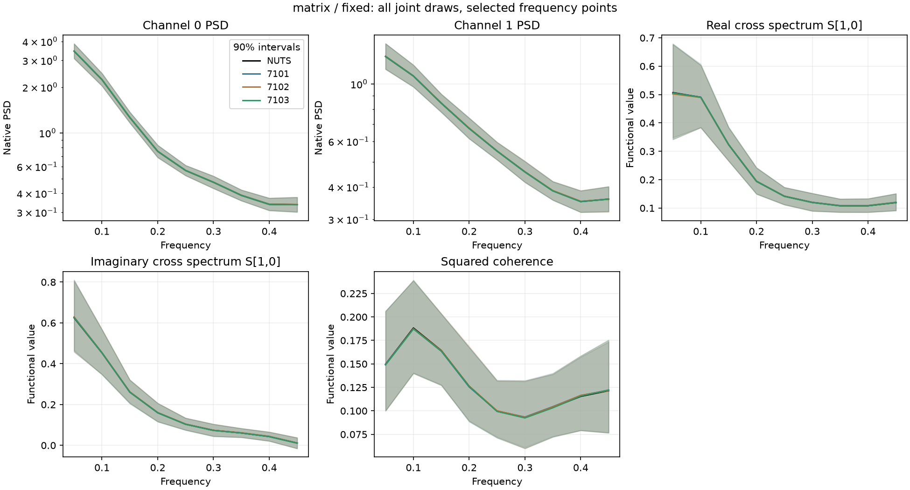
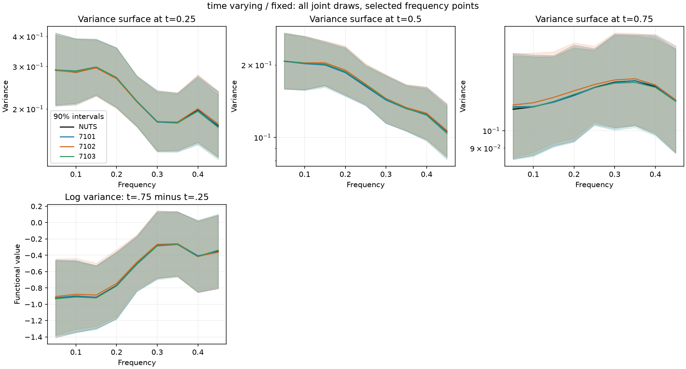

# Native multivariate and scalar time-varying VI/NUTS study

This is a bounded extension on `hacking-vi-nuts-validation`. The optimizer and MC-aware screens are inherited from the completed stationary continuation; observations, numerical bases, penalties, priors and likelihoods are identical within each fixed/hierarchical comparison. Fixed and inferred smoothing are distinct statistical targets.

Multivariate fixed smoothing passed final primary and coefficient agreement, both late stability screens and all three seed-pair comparisons. Its inferred-smoothing reference remained unusable after one repair, so hierarchical VI was not run. The time-varying fixed control passed final agreement only for seed 7101; every seed failed late stability and the seed pairs failed repeatability. Its hierarchy stayed locked. These results support the multivariate fixed-target candidate, not a general stationary or time-varying VI preset.

Exactly four new four-chain NUTS attempts and six full-covariance 60k VI fits ran. No VI attempt failed to execute, no saved-guide precision refinement was triggered, and all six fits/checkpoints/density reconstructions were preserved. Two diagnosed fixed references are usable. The two failed hierarchical multivariate reference attempts are retained; the inherited time-varying hierarchical reference was not opened for a scientific comparison because the fixed gate failed.

## What ran

| Case | Smoothing | Seed | Final posterior agreement | Late optimization stability | Physical coefficient agreement |
|---|---|---|---|---|---|
| matrix | fixed | 7101 | within_screen | within_screen | within_screen |
| matrix | fixed | 7102 | within_screen | within_screen | within_screen |
| matrix | fixed | 7103 | within_screen | within_screen | within_screen |
| matrix | hierarchical | 7101 | not_run_reference_prerequisite | not assessed | not assessed |
| matrix | hierarchical | 7102 | not_run_reference_prerequisite | not assessed | not assessed |
| matrix | hierarchical | 7103 | not_run_reference_prerequisite | not assessed | not assessed |
| time_varying | fixed | 7101 | within_screen | outside_screen | within_screen |
| time_varying | fixed | 7102 | outside_screen | outside_screen | mc_precision_limited |
| time_varying | fixed | 7103 | outside_screen | outside_screen | mc_precision_limited |
| time_varying | hierarchical | 7101 | not_run_fixed_gate | not assessed | not assessed |
| time_varying | hierarchical | 7102 | not_run_fixed_gate | not assessed | not assessed |
| time_varying | hierarchical | 7103 | not_run_fixed_gate | not assessed | not assessed |

Seed repeatability is assessed independently of accuracy and within-seed stability:

- matrix/fixed: repeatability `within_screen`, repeatable recipe `True`, hierarchy unlock `True`.
- matrix/hierarchical: repeatability `unavailable`, repeatable recipe `False`, hierarchy unlock `False`.
- time_varying/fixed: repeatability `outside_screen`, repeatable recipe `False`, hierarchy unlock `False`.

## Reference diagnoses

| Case/target | Attempt | Status | Max Rhat | Min bulk/tail ESS | Min BFMI | Divergences/cap hits | Max primary mean MCSE/SD |
|---|---|---|---|---|---|---|---|
| matrix/fixed | initial | accepted_screen | 1.00175 | 5320/5365 | 0.987 | 0/0 | 0.0086 |
| matrix/hierarchical | initial | failed_reference | 1.00730 | 493/418 | 0.411 | 137/0 | 0.0451 |
| matrix/hierarchical | repair_1 | failed_reference | 1.00286 | 1061/1207 | 0.413 | 0/3 | 0.0340 |
| time_varying/fixed | initial | accepted_screen | 1.00169 | 5161/5197 | 1.011 | 0/0 | 0.0099 |

Four chains run sequentially in float64 with dense mass. Initial settings: 1000 warmup/2000 draws per chain, acceptance .95, depth 10. One retained repair per target: 2000/4000, acceptance .99, depth 10. Health requires Rhat <1.01, bulk/tail ESS >=400, BFMI >=.3, no divergences or cap hits, mean MCSE/SD <=.05; primary-function precision additionally requires <=.02. A failed reference prevents scientific VI-versus-NUTS claims for that target.

## Posterior uncertainty and joint diagnostics

| Case/target/seed | Max absolute mean error / reference SD | Primary SD ratio range | Packed PSIS k range | Smoothed weight ESS fraction |
|---|---|---|---|---|
| matrix/fixed/7101 | 0.0427 | 0.965–1.038 | 0.187–0.283 | 0.931–0.936 |
| matrix/fixed/7102 | 0.0625 | 0.974–1.034 | 0.174–0.263 | 0.929–0.930 |
| matrix/fixed/7103 | 0.0419 | 0.966–1.032 | 0.156–0.305 | 0.934–0.935 |
| time_varying/fixed/7101 | 0.0743 | 0.974–1.021 | 0.431–0.547 | 0.436–0.524 |
| time_varying/fixed/7102 | 0.1549 | 0.968–1.015 | 0.409–0.540 | 0.364–0.459 |
| time_varying/fixed/7103 | 0.1486 | 0.972–1.013 | 0.517–0.630 | 0.402–0.475 |

The primary mean screen is ±.1 reference SD and the SD-ratio screen [.9,1.1]. Both retain two-MCSE uncertainty. Late intervals are 40k→50k and 50k→60k, with paired joint draw keys; mean drift is limited to .1 reference SD and symmetric SD drift to .05. Objective changes use .2 plus two paired MCSE. Seed comparisons use unpaired posterior MC uncertainty. Unavailable or precision-limited outcomes never pass. One optional saved-guide precision refinement uses 16,384 checkpoint and 32,768 final draws; base estimates remain saved.

Every final comparison retains 50/90/95% interval-width ratios, standardized Wasserstein distances, coefficient marginals/correlations, roughness penalty energies and MMD on functionals and packed native latents. MMD uses disjoint reference training/chain subsets and matched counts with NUTS–NUTS and VI–VI baselines; it is descriptive for autocorrelated chains and has no IID permutation p-value. Joint PSIS evaluates full priors, hyperpriors, likelihood and Jacobians together on three independent 4096-particle diagnostic streams. PSIS is not a posterior-accuracy pass criterion. Raw VI draws are never reweighted.

### Joint and interval summaries

| Case/target/seed | 90% width ratio | 95% width ratio | Native PSIS k | Functional MMD²: VI–NUTS / NUTS–NUTS / VI–VI | Latent MMD²: same order |
|---|---|---|---|---|---|
| matrix/fixed/7101 | 0.964–1.045 | 0.962–1.043 | 0.260–0.433 | 0.000653 / 0.000618 / 0.000289 | 0.000499 / 0.000362 / 0.00014 |
| matrix/fixed/7102 | 0.964–1.032 | 0.968–1.034 | 0.141–0.429 | 0.000198 / 0.000618 / -0.000213 | 0.000297 / 0.000362 / -0.000154 |
| matrix/fixed/7103 | 0.969–1.038 | 0.970–1.030 | 0.231–0.462 | 0.000334 / 0.000618 / 7.12e-05 | 0.000263 / 0.000362 / 4.43e-05 |
| time_varying/fixed/7101 | 0.971–1.025 | 0.963–1.023 | 0.254–0.607 | 0.000585 / -0.000129 / 9.11e-05 | 0.000604 / -1.82e-07 / 4.48e-05 |
| time_varying/fixed/7102 | 0.966–1.019 | 0.950–1.028 | 0.300–0.664 | 0.00113 / -0.000129 / 0.00028 | 0.00118 / -1.82e-07 / 0.000281 |
| time_varying/fixed/7103 | 0.970–1.012 | 0.966–1.017 | 0.306–0.530 | 0.000613 / -0.000129 / 5.38e-05 | 0.000704 / -1.82e-07 / 2.68e-05 |

MMD values average the frozen kernel bandwidths. Negative values can occur for this unbiased estimator. The multivariate VI–NUTS values are of the same order as the disjoint NUTS-chain baseline. The time-varying values exceed its near-zero reference baseline, supporting a retained joint discrepancy even though its marginal SDs are close. This is descriptive evidence, not a formal significance test. No joint-diagnostic threshold was silently added to the continuation gate.

All primary time-varying SD and interval-width point ratios are close to one; its resolved discrepancies are in means and late mean drift. Maximum 40k→50k / 50k→60k mean drift in reference SD units was .138/.197 (7101), .148/.234 (7102), and .184/.106 (7103). Changes in paired objective stayed inside the inherited tolerance, so a quiet objective would have missed the instability. The multivariate hierarchical repair removed divergences but had three trajectory-cap hits and primary mean MCSE/SD .0340; physical/log sigma_theta_re_1_0 precision was .0340/.0317, and log sigma_delta_1 was .0219. Both sampler depth and named roughness precision remain unresolved.

### Primary feature details

- matrix/fixed/7101: all primary mean and SD screens resolved within bounds.
- matrix/fixed/7102: all primary mean and SD screens resolved within bounds.
- matrix/fixed/7103: all primary mean and SD screens resolved within bounds.
- time_varying/fixed/7101: all primary mean and SD screens resolved within bounds.
- time_varying/fixed/7102: 16 primary features have unresolved/outside fields; see `summary.json` and `comparison_rows.csv`.
  - `log_S_t0.5_f0.15`: mean mc_precision_limited, SD within_screen; SD ratio 1.015 ± 0.024 (two MCSE).
  - `log_S_t0.5_f0.2`: mean mc_precision_limited, SD within_screen; SD ratio 1.003 ± 0.025 (two MCSE).
  - `log_S_t0.5_f0.25`: mean mc_precision_limited, SD within_screen; SD ratio 0.990 ± 0.023 (two MCSE).
  - `log_band_t0.5_b1`: mean outside_screen, SD within_screen; SD ratio 0.992 ± 0.023 (two MCSE).
  - `log_S_t0.75_f0.05`: mean mc_precision_limited, SD within_screen; SD ratio 0.979 ± 0.026 (two MCSE).
  - `log_S_t0.75_f0.1`: mean mc_precision_limited, SD within_screen; SD ratio 0.975 ± 0.025 (two MCSE).
  - `log_S_t0.75_f0.15`: mean outside_screen, SD within_screen; SD ratio 1.006 ± 0.025 (two MCSE).
  - `log_S_t0.75_f0.2`: mean mc_precision_limited, SD within_screen; SD ratio 1.003 ± 0.027 (two MCSE).
  - `log_S_t0.75_f0.25`: mean mc_precision_limited, SD within_screen; SD ratio 0.996 ± 0.024 (two MCSE).
  - `log_band_t0.75_b0`: mean outside_screen, SD within_screen; SD ratio 0.980 ± 0.024 (two MCSE).
  - `log_band_t0.75_b1`: mean outside_screen, SD within_screen; SD ratio 0.995 ± 0.024 (two MCSE).
  - `temporal_contrast_f0.05`: mean mc_precision_limited, SD within_screen; SD ratio 0.989 ± 0.024 (two MCSE).
- time_varying/fixed/7103: 5 primary features have unresolved/outside fields; see `summary.json` and `comparison_rows.csv`.
  - `log_S_t0.25_f0.4`: mean mc_precision_limited, SD within_screen; SD ratio 0.996 ± 0.024 (two MCSE).
  - `log_S_t0.25_f0.45`: mean mc_precision_limited, SD within_screen; SD ratio 0.991 ± 0.025 (two MCSE).
  - `log_band_t0.25_b2`: mean mc_precision_limited, SD within_screen; SD ratio 0.995 ± 0.023 (two MCSE).
  - `log_S_t0.5_f0.45`: mean outside_screen, SD within_screen; SD ratio 0.998 ± 0.023 (two MCSE).
  - `log_band_t0.5_b2`: mean mc_precision_limited, SD within_screen; SD ratio 0.984 ± 0.023 (two MCSE).

## Frozen inputs, scope and budgets

The multivariate observation is one two-channel stationary VAR(1) development record (seed 62001, 4096 samples, dt=1), initialized from its Lyapunov stationary covariance, without realization normalization. Eight rectangular FFT blocks produce 255 positive non-Nyquist bins, duration 512, no taper, detrending, eigenvalue floor or coarse-graining. The native centered modified-Cholesky target uses four cubic eight-coefficient splines, integrated second-derivative penalties and HalfNormal(1.28) scales. Fixed scales are each 0.86334688025. The joint model exactly sums existing native channel models; it uses one joint full Gaussian rather than the public fitter's product of per-channel guides. This validates the prepared native target and optimizer, not an untested public preset.

The scalar time-varying target reuses `runs/vi-nuts-validation-v2/exact_time_varying/target.npz`: 33 time cells ×33 frequency cells (1089 cells, each count=2), native 8×6 tensor basis, saved penalties, exact independent Gamma powers and counts. Its physical target fingerprint is `1e7a3be31733307e19296b3a4230829b16065b39f9ac7c405db465e46ae23bdb`. Native noncentered coordinates, HalfNormal(10), null precision 1e-4 and ridge 1e-6 are unchanged. Fixed scales are each 6.74489750196. This is a variance/power control; integrated band variance is a model functional, not raw-process calibrated band variance. No moving-periodogram fit or locality approximation is assessed here.

Primary quantities cover nine frequencies, three bands integrated on 129 quadrature nodes, both multivariate autospectra, signed real/imaginary cross spectrum S[1,0], squared coherence, three time slices and temporal contrasts. Inferred targets additionally include every physical/log roughness scale. All reconstruction uses complete joint draws, never PSD previews. Positive-definite/Hermitian matrices and coherence bounds are checked on every draw at the primary grid.

Each fitted guide uses seeds 7101–7103, eight optimization particles, Adam with existing clipping, the original .001→.01 warmup (1000 updates), cosine decay with exactly the original 40k horizon and end rate 1e-4, followed by a constant 1e-4 tail through 60k. No cosine stretching, guide-checkpoint optimizer resume, diagonal rerun, parameterization sweep, flow, benchmark, untouched confirmation or AR4 reserved seed was run. At most three VI fits and one reference repair per target were permitted. A hierarchy unlock requires at least one accepted-accuracy seed stable in both late intervals; a repeatable recipe separately requires all three such seeds and all three seed pairs.

The cleanup extracted shared numerical helpers and archived superseded drivers without deleting evidence. Pre-cleanup versus extracted MC statistics/comparisons/stability were bitwise equal. Thirty-one stationary source-artifact hashes still match. Density/gradient, conditioning, joint-draw integration and stop-gate tests passed. A pre-inference implementation amendment is saved separately; it changed no statistical settings or observations. The full suite passed 176 tests (28 warnings) in 64.80 s; warnings are retained in the test log.

## Costs and retained artifacts

| Case/target | Kind | Identifier | Wall seconds |
|---|---|---|---|
| matrix/fixed | reference | initial | 7.28 |
| matrix/hierarchical | reference | initial | 22.42 |
| matrix/hierarchical | reference | repair_1 | 43.41 |
| time_varying/fixed | reference | initial | 8.29 |
| matrix/fixed | vi | 7101 | 12.28 |
| matrix/fixed | vi | 7102 | 12.31 |
| matrix/fixed | vi | 7103 | 13.02 |
| time_varying/fixed | vi | 7101 | 10.34 |
| time_varying/fixed | vi | 7102 | 10.30 |
| time_varying/fixed | vi | 7103 | 10.58 |

`timings.csv` separates initialization, the first compile-containing chunk, remaining optimization, joint posterior draws, density diagnostics and persistence. Reference timing separates warmup/sampling from persistence and feature/health analysis. Checkpoint clocks, losses, complete guide parameters, all physical posterior draws, three joint density streams, source hashes, health arrays, comparisons and failed attempts are retained. Worker and offline reporting costs are also separate. These descriptive costs are not a matched-accuracy speed comparison; historical times cannot establish a speed advantage.

Full ignored numerical archive: `/Users/avi/.codex/worktrees/18a1/LogPSplinePSD/runs/vi-matrix-tv`. Saved [summary](../../../runs/vi-matrix-tv/summary.json), [feature comparisons](../../../runs/vi-matrix-tv/comparison_rows.csv), [timing breakdown](../../../runs/vi-matrix-tv/timings.csv) and [attempt ledger](../../../runs/vi-matrix-tv/attempts.jsonl). These local artifacts require separate preservation; Git contains code and this report.

## Figures

The posterior overlays below use every saved final joint draw and 90% intervals at the declared frequency points. Their visual similarity does not replace the MC-aware mean and late-stability screens.

[Multivariate uncertainty ratios](figures/extensions_matrix_fixed_uncertainty_ratios.png) and [time-varying uncertainty ratios](figures/extensions_time_varying_fixed_uncertainty_ratios.png) show two-MCSE intervals for all primary SD ratios. Source PNG/PDF figures remain in each target directory.

## Supported next experiment

For the time-varying control, keep exactly these fixed-smoothing observations, basis and likelihood and compare a small declared set of lower tail learning rates and/or more optimization particles using all three seeds and the same checkpoint quantities. The observed mean drift, rather than deficient marginal SDs or the objective, makes optimization stability the first question. Lower rates or more particles are candidate explanations to test, not established fixes. Do not add hierarchy or guide flexibility before that gate passes.

For the multivariate hierarchy, first inspect saved trajectory lengths, per-chain physical/log roughness and coefficient–penalty dependence. A separately budgeted deeper/longer four-chain reference may be warranted, but the present repair budget is exhausted; no claim about hierarchical VI accuracy follows from these failed references. No parameterization change was made. The fixed multivariate result alone could motivate a future target-specific matched-accuracy study, but the combined results do not justify general efficiency benchmarking or a speed claim.
